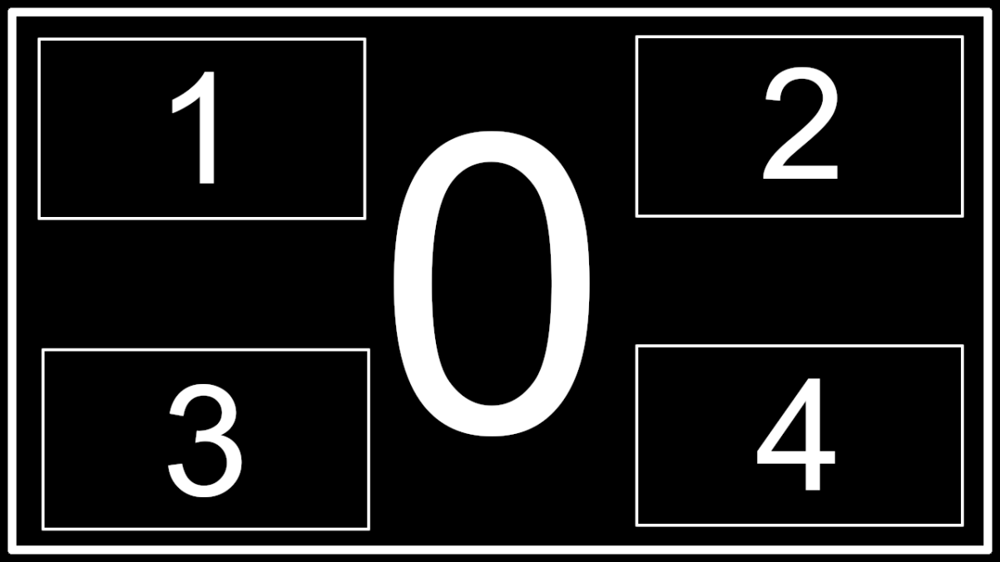

# Twitch Bot

This is the official documentation for the SHiFT modcast twitch-bot integration.

&nbsp;

***

## Usage & Examples

### Command Pattern

Each command follows the general template of `!obs <command name> <parameter 1> ... <parameter N>` 

For the purposes of documentation, any command-string wrapped in `<>` is a configurable parameter and anything else is a literal-value. Any paramter beginning with a `?` is an optional parameter that use some default-value, if left empty. Ex: `<?some parameter name (Default: null)>`.

&nbsp;

***

## Diagram

The modcast restream layout follows this pattern:

Whereby each layout bounding-box corresponds to its `stream-index` number.

&nbsp;

> Note: Stream-index 0 has z-index priority over indicies 1, 2, 3, and 4. (I.e. Stream 0 is on-top of all of the other streams).

&nbsp;

## Commands

* `stream`:
    * Set the source for one of the stream-indicies.
    * Usage: `stream <stream-index> <?twitch-channel (Default: null)>`
        * `stream-index`: Acceptable range is integer-value `0 - 4`
        * `twitch-channel`: Acceptable range is any string-value, if left empty, the default behavior is to unset the stream source

* `volume`:
    * Set the volume for one of the stream indicies.
    * Usage: `volume <stream-index> <volume-level> <?volume-units (Default: percentage)>`
        * `stream-index`: Acceptable range is integer-value `0 - 4`
        * `volume-units`: Can be either `percentage` or `decibels`, percentage is a normalized-scalar, i.e. `0` is `0%`, `1` is `100%`, `4.5` is `450%`, etc.
        * `<volume-level>`: Acceptable range is float-value `0.0 - 26.0` if `volume-units=percentage`, or float-value `12.0 - -86.0` if `volume-units=decibels`

&nbsp;

***

## Example commands

**Set stream-index 0 to shift:**
* `!obs stream 0 shift`

**Unset stream-index 1:**
* `!obs stream 0`

**Set volume for stream-index 2 to 210%:**
* `!obs volume 2 2.1`